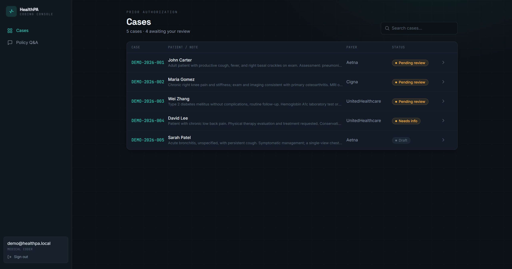
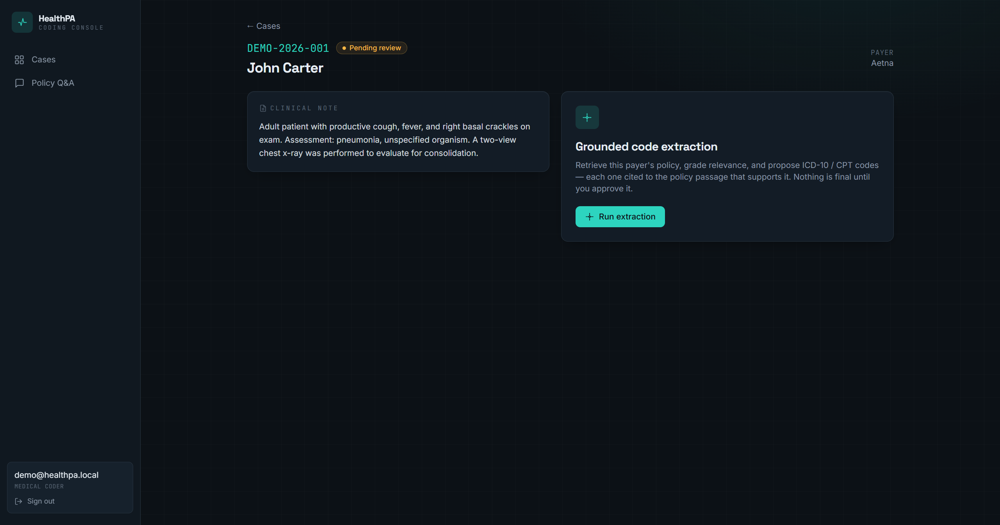
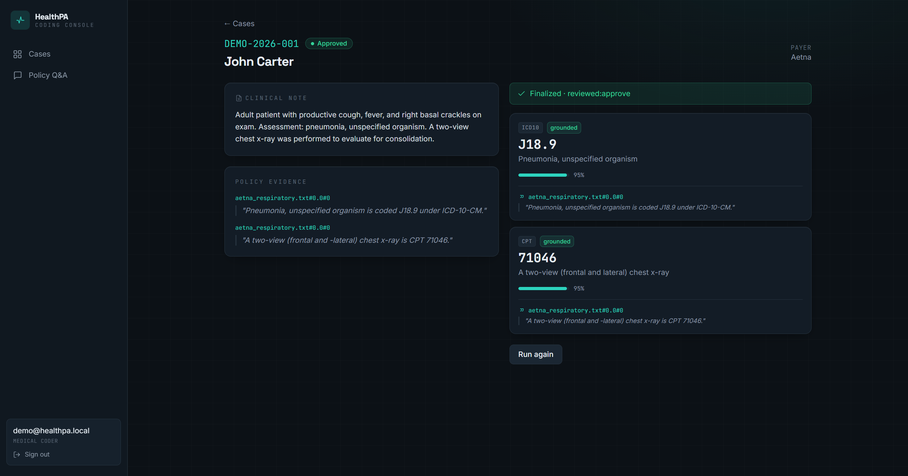
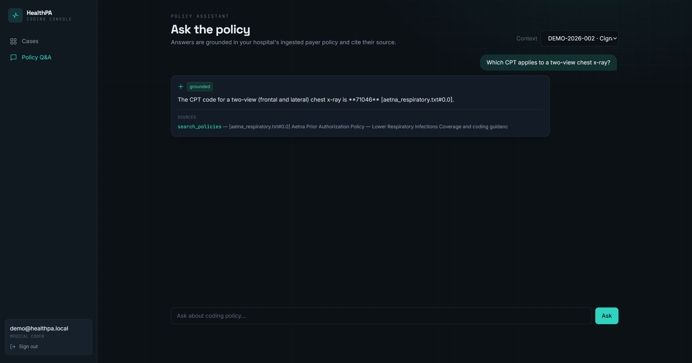

# HealthPA

> Multi-tenant healthcare prior-authorization SaaS with **grounded, human-reviewed AI medical coding**.

HealthPA turns clinical notes into **policy-grounded ICD-10 / CPT codes** that a human approves before they're final. The AI proposes codes *only* from retrieved payer policy, cites the exact passage, and pauses for human sign-off — no code is emitted without evidence.


---

## Features

- **Grounded coding (RAG)** — codes are extracted from retrieved payer/coding policy with citations; ungrounded suggestions are dropped.
- **Human-in-the-loop** — LangGraph `interrupt`/resume review: **approve · reject · edit**, durable across restarts (Postgres checkpointer); approval advances the case status.
- **Multi-agent** — supervisor routing + a ReAct policy-QA assistant (optional Tavily web search).
- **Multi-tenant & secure** — strict `hospital_id` isolation, JWT/RBAC, HIPAA-style audit trail.
- **PA workflow** — finite-state machine, OCR uploads, batch import, analytics, AWS SES email.
- **Evaluation** — RAGAS (faithfulness, context precision/recall) + deterministic precision/recall/F1.
- **Tested** — 138 passing tests (PostgreSQL-backed; the AI layer runs fully offline in tests).

---

## Tech stack

FastAPI · async SQLAlchemy 2 · PostgreSQL 15 · Celery + Redis · **LangGraph + LangChain** · **Pinecone** · LM Studio / Groq / OpenAI (provider-agnostic) · **RAGAS** · React + Vite + Tailwind · Docker

---

## Quickstart

**Backend**
```bash
pip install -r requirements.txt
cp .env.example .env            # configure DB + AI provider
python manage_db.py init        # create schema + tables
uvicorn app.main:app --reload   # http://localhost:8000  (/docs for Swagger)
```

**Frontend**
```bash
cd frontend
npm install
npm run dev                     # http://localhost:5173
```

**Demo data (optional, recommended)**
```bash
python -m scripts.seed_demo     # demo hospital + cases + ingested policy
# log in:  demo@healthpa.local  /  demo12345
```

> The AI layer needs a chat model + embeddings (local **LM Studio** by default, or Groq/OpenAI via env) and **Pinecone** for vectors. Without them the flow degrades gracefully to a rule-based fallback. See `.env.example` for all settings.

---

## AI endpoints (JWT + hospital-scoped)

| Method | Path | Purpose |
|---|---|---|
| `POST` | `/api/v1/pa/{id}/extract` | RAG + grounded extraction; pauses for review |
| `GET`  | `/api/v1/pa/{id}/proposed-codes` | Proposed codes + citations |
| `POST` | `/api/v1/pa/{id}/review` | `{decision: approve\|reject\|edit}` → finalize |
| `POST` | `/api/v1/pa/{id}/ask` | Policy Q&A (ReAct / RAG) |
| `POST` | `/api/v1/policies/reindex` | Rebuild the hospital's policy index |

---

## Screenshots

| | |
|---|---|
|  |  |
|  |  |

---

## Testing

```bash
pytest -q          # 138 tests (needs a reachable PostgreSQL)
```

Evaluate coding quality: `python -m scripts.evaluate --ragas` (needs a chat model).

---

## License

Proprietary — all rights reserved.
