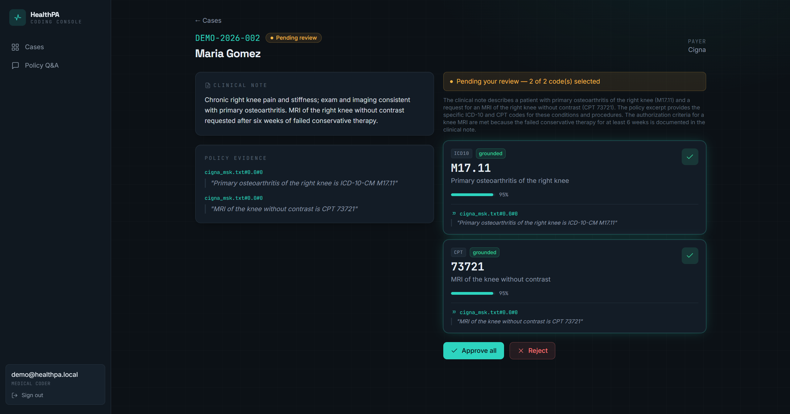

# HealthPA

> A healthcare prior authorization platform with grounded, human reviewed AI medical coding.

HealthPA turns clinical notes into policy grounded ICD 10 and CPT codes that a human approves before they are final. The AI proposes codes only from retrieved payer policy, cites the exact passage, and pauses for human signoff. No code is emitted without evidence.

## Live demo

| App | Link | Login |
|---|---|---|
| HealthPA | https://healthpa.3-230-42-191.sslip.io | `demo@healthpa.local` / `demo12345` |

Open a case, click **Run extraction**, review the proposed codes, then approve, reject, or edit.



## What it does

- **Grounded coding (RAG).** Codes come from retrieved payer policy with citations. Ungrounded guesses are dropped.
- **Human in the loop.** A LangGraph review step lets a coder approve, reject, or edit. Approve and reject both move the case status.
- **Multi agent.** A supervisor routes work and a policy question assistant answers from the same policy (optional web search).
- **Multi tenant and secure.** Strict hospital isolation, JWT and role based access, and a HIPAA style audit trail.
- **Full PA workflow.** A state machine, OCR uploads, batch import, analytics, and email through AWS SES.
- **Evaluation.** RAGAS scores plus deterministic precision, recall, and F1.
- **Tested.** 138 passing tests; the AI layer runs fully offline in tests.

## Tech stack

FastAPI, async SQLAlchemy 2, PostgreSQL, Celery and Redis, LangGraph and LangChain, Pinecone, Groq or OpenAI or local LM Studio (provider agnostic), RAGAS, React with Vite and Tailwind, Docker.

## Run it locally

Backend:
```bash
pip install -r requirements.txt
cp .env.example .env            # set the database and the AI provider
python init_db.py               # create the tables
uvicorn app.main:app --reload   # http://localhost:8000  (/docs for Swagger)
```

Frontend:
```bash
cd frontend
npm install
npm run dev                     # http://localhost:5173
```

Demo data:
```bash
python -m scripts.seed_demo     # demo hospital, cases, and ingested policy
# login:  demo@healthpa.local  /  demo12345
```

> The AI layer needs a chat model and embeddings (Groq or OpenAI, or local LM Studio) plus Pinecone for vectors. Without them the flow falls back to a simple rule based path. See `.env.example` for every setting.

## Main AI endpoints (JWT and hospital scoped)

| Method | Path | Purpose |
|---|---|---|
| `POST` | `/api/v1/pa/{id}/extract` | RAG plus grounded extraction; pauses for review |
| `GET`  | `/api/v1/pa/{id}/proposed-codes` | Proposed codes with citations |
| `POST` | `/api/v1/pa/{id}/review` | `{decision: approve, reject, edit}` finalizes the case |
| `POST` | `/api/v1/pa/{id}/ask` | Policy question and answer |
| `POST` | `/api/v1/policies/reindex` | Rebuild the hospital policy index |

## Deployment

Deployed on AWS with Terraform (one EC2 host, managed RDS, S3, SES, secrets in SSM, free HTTPS via Caddy and Let's Encrypt). The infrastructure code lives in a separate `infra-deploy` repository.

## Testing

```bash
pytest -q          # 138 tests (needs a reachable PostgreSQL)
```

Evaluate coding quality with `python -m scripts.evaluate --ragas`.

## License

Proprietary. All rights reserved.
